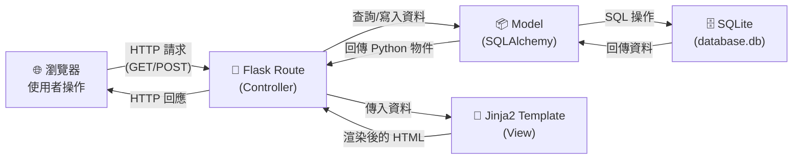
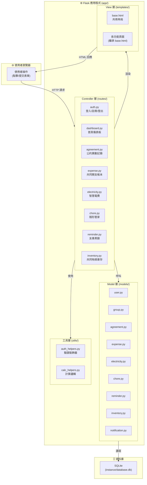
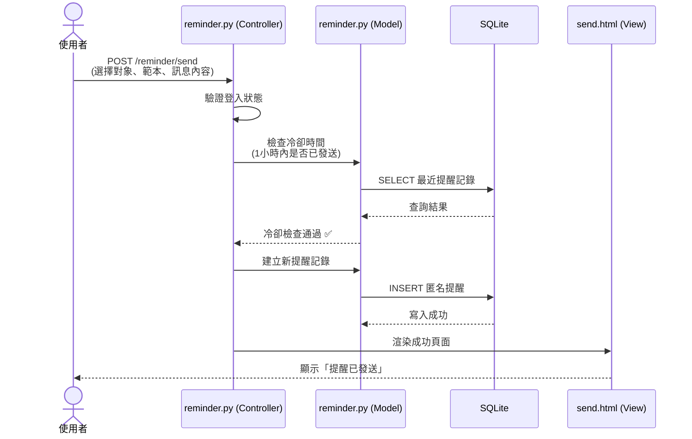

# 系統架構文件：宿舍共好 — 室友公約與噪音管理系統

---

## 1. 技術架構說明

### 1.1 選用技術與原因

| 技術 | 用途 | 選用原因 |
| :--- | :--- | :--- |
| **Python 3** | 程式語言 | 語法簡潔易讀，適合初學者與快速開發；社群龐大、套件豐富 |
| **Flask** | 後端 Web 框架 | 輕量級微框架，學習曲線低；只引入需要的功能，不會有過多「魔法」；非常適合中小型專案 |
| **Jinja2** | HTML 模板引擎 | Flask 內建支援，語法直觀（`{{ 變數 }}`、``）；支援模板繼承，方便共用頁面佈局 |
| **SQLite** | 資料庫 | 零設定、不需安裝額外資料庫伺服器；單一檔案即為整個資料庫，方便備份與搬移；對小規模群組（2～8 人）的資料量綽綽有餘 |
| **SQLAlchemy** | ORM（物件關係映射） | 讓開發者用 Python 類別操作資料庫，不需手寫大量 SQL；支援 SQLite，且未來如需升級至 PostgreSQL 等資料庫只需更換連線字串 |
| **HTML / CSS / JavaScript** | 前端技術 | 不使用前端框架，降低學習門檻；搭配 Jinja2 實現伺服器端渲染（SSR），開發流程更簡單 |
| **Git + GitHub** | 版本控制 | 追蹤程式碼變更歷史、支援團隊協作、方便 Code Review |

### 1.2 Flask MVC 模式說明

本專案採用 **MVC（Model–View–Controller）** 架構模式來組織程式碼，將不同職責拆分到獨立的模組中，讓程式碼更好維護、更好閱讀。

```
┌─────────────────────────────────────────────────────────────┐
│                        MVC 模式                              │
├───────────────┬───────────────────┬─────────────────────────┤
│    Model      │    View           │    Controller           │
│  （模型層）    │  （視圖層）        │  （控制層）              │
├───────────────┼───────────────────┼─────────────────────────┤
│ 定義資料結構   │ 負責畫面呈現       │ 接收請求、處理邏輯       │
│ 與資料庫互動   │ HTML 模板          │ 協調 Model 與 View      │
│ 資料驗證      │ 使用者看到的頁面    │ 決定回傳什麼給使用者      │
├───────────────┼───────────────────┼─────────────────────────┤
│ app/models/   │ app/templates/    │ app/routes/             │
│ SQLAlchemy    │ Jinja2 模板       │ Flask Blueprint         │
└───────────────┴───────────────────┴─────────────────────────┘
```

**簡單比喻：**

> 想像你去餐廳吃飯——
> - **Controller（服務生）**：接收你的點餐需求，把訂單傳給廚房，再把菜端給你。
> - **Model（廚房）**：負責準備食材（資料），把餐點（資料結果）做好。
> - **View（餐盤擺盤）**：把做好的菜漂亮地擺在盤子上（HTML 頁面），端到你面前。

---

## 2. 專案資料夾結構

```
roommate-system/                  ← 專案根目錄
│
├── app/                          ← 應用程式主目錄（所有核心程式碼都在這裡）
│   │
│   ├── __init__.py               ← Flask App 工廠函式，建立並設定 Flask 應用
│   │
│   ├── models/                   ← Model 層：資料庫模型定義
│   │   ├── __init__.py           ← 匯出所有 Model，方便其他地方 import
│   │   ├── user.py               ← 使用者模型（帳號、密碼雜湊、角色）
│   │   ├── group.py              ← 群組模型（寢室 / 租屋群組）
│   │   ├── agreement.py          ← 公約模型（條文內容、版本歷史）
│   │   ├── expense.py            ← 共同開支模型（帳本記錄、分攤計算）
│   │   ├── electricity.py        ← 智慧電費模型（帳單、電表度數）
│   │   ├── chore.py              ← 隱形管家模型（任務排班、完成狀態）
│   │   ├── reminder.py           ← 友善黑臉模型（匿名提醒、冷卻機制）
│   │   ├── inventory.py          ← 共同物資模型（品項、庫存、入出庫記錄）
│   │   └── notification.py       ← 站內通知模型（系統提醒訊息）
│   │
│   ├── routes/                   ← Controller 層：Flask 路由（Blueprint）
│   │   ├── __init__.py           ← 註冊所有 Blueprint
│   │   ├── auth.py               ← 身份驗證路由（註冊、登入、登出）
│   │   ├── dashboard.py          ← 首頁 / 儀表板路由
│   │   ├── group.py              ← 群組管理路由（建立、加入、設定）
│   │   ├── agreement.py          ← 公約異動記錄路由
│   │   ├── expense.py            ← 共同開支帳本路由
│   │   ├── electricity.py        ← 智慧電費路由
│   │   ├── chore.py              ← 隱形管家路由
│   │   ├── reminder.py           ← 友善黑臉路由
│   │   └── inventory.py          ← 共同物資庫存路由
│   │
│   ├── templates/                ← View 層：Jinja2 HTML 模板
│   │   ├── base.html             ← 基礎佈局模板（導覽列、頁尾、共用 CSS/JS 引入）
│   │   ├── auth/                 ← 身份驗證相關頁面
│   │   │   ├── login.html        ← 登入頁
│   │   │   └── register.html     ← 註冊頁
│   │   ├── dashboard/            ← 儀表板頁面
│   │   │   └── index.html        ← 首頁（總覽通知、待辦、快捷入口）
│   │   ├── group/                ← 群組管理頁面
│   │   │   ├── create.html       ← 建立群組
│   │   │   ├── join.html         ← 加入群組
│   │   │   └── settings.html     ← 群組設定
│   │   ├── agreement/            ← 公約異動記錄頁面
│   │   │   ├── list.html         ← 公約列表
│   │   │   ├── detail.html       ← 公約詳情與歷史版本
│   │   │   └── form.html         ← 新增 / 編輯公約表單
│   │   ├── expense/              ← 共同開支帳本頁面
│   │   │   ├── list.html         ← 帳本列表
│   │   │   ├── balance.html      ← 餘額總覽
│   │   │   └── form.html         ← 新增消費記錄表單
│   │   ├── electricity/          ← 智慧電費頁面
│   │   │   ├── list.html         ← 電費帳單列表
│   │   │   ├── detail.html       ← 分攤明細
│   │   │   └── form.html         ← 登錄帳單 / 電表表單
│   │   ├── chore/                ← 隱形管家頁面
│   │   │   ├── calendar.html     ← 輪值日曆
│   │   │   ├── list.html         ← 任務列表
│   │   │   └── form.html         ← 新增 / 編輯任務表單
│   │   ├── reminder/             ← 友善黑臉頁面
│   │   │   ├── send.html         ← 發送匿名提醒
│   │   │   ├── inbox.html        ← 收到的提醒
│   │   │   └── stats.html        ← 統計摘要（管理者）
│   │   └── inventory/            ← 共同物資庫存頁面
│   │       ├── list.html         ← 物資清單
│   │       ├── detail.html       ← 物資詳情（入出庫歷史）
│   │       └── form.html         ← 新增 / 編輯物資表單
│   │
│   ├── static/                   ← 靜態資源（瀏覽器直接存取）
│   │   ├── css/
│   │   │   └── style.css         ← 全站樣式表
│   │   ├── js/
│   │   │   └── main.js           ← 全站 JavaScript（表單驗證、互動效果）
│   │   └── images/               ← 圖片資源（Logo、圖示等）
│   │
│   └── utils/                    ← 工具函式模組
│       ├── __init__.py
│       ├── auth_helpers.py       ← 登入驗證裝飾器、密碼雜湊工具
│       └── calc_helpers.py       ← 電費分攤計算、帳務計算等共用邏輯
│
├── instance/                     ← Flask 實例資料夾（不納入版本控制）
│   └── database.db               ← SQLite 資料庫檔案（執行後自動產生）
│
├── docs/                         ← 專案文件
│   ├── PRD.md                    ← 產品需求文件
│   └── ARCHITECTURE.md           ← 系統架構文件（本文件）
│
├── app.py                        ← 應用程式入口（啟動 Flask 伺服器）
├── requirements.txt              ← Python 套件依賴清單
├── .gitignore                    ← Git 忽略規則
└── README.md                     ← 專案說明文件
```

### 資料夾功能摘要

| 資料夾 / 檔案 | 對應角色 | 說明 |
| :--- | :--- | :--- |
| `app/models/` | **Model** | 定義資料表結構，負責所有資料庫讀寫操作 |
| `app/routes/` | **Controller** | 接收 HTTP 請求，呼叫 Model 取得資料，選擇適當的 Template 回傳 |
| `app/templates/` | **View** | 用 Jinja2 語法撰寫 HTML 頁面，將 Controller 傳來的資料渲染成畫面 |
| `app/static/` | — | CSS、JavaScript、圖片等不需經過 Python 處理的靜態檔案 |
| `app/utils/` | — | 被多個 Route 或 Model 共用的工具函式，避免重複程式碼 |
| `instance/` | — | 存放 SQLite 資料庫檔案，不納入 Git 版本控制 |

---

## 3. 元件關係圖

### 3.1 整體請求流程（Mermaid）



### 3.2 詳細元件互動圖（Mermaid）



### 3.3 使用者操作範例：發送匿名提醒

以下展示「友善黑臉」功能的完整資料流：



---

## 4. 關鍵設計決策

### 決策 1：使用 Flask Blueprint 模組化路由

**選擇：** 將每個功能模組拆成獨立的 Blueprint（如 `auth_bp`、`expense_bp`、`reminder_bp`），而非全部寫在同一個檔案。

**原因：**
- 本系統有 **六大核心功能** 加上身份驗證與群組管理，若全部路由擠在一個檔案中，將超過上千行，難以維護。
- Blueprint 讓每個功能模組可以 **獨立開發與測試**，適合多人分工。
- 未來新增功能（如聊天室、投票表決）只需新增一個 Blueprint，不影響現有程式碼。

---

### 決策 2：選用 SQLAlchemy ORM 而非直接使用 sqlite3

**選擇：** 使用 Flask-SQLAlchemy 套件操作資料庫，而非手寫 SQL 語句。

**原因：**
- ORM 讓開發者用 **Python 類別和方法** 操作資料（例如 `User.query.filter_by(email=email).first()`），比手寫 SQL 更直觀、更不容易出錯。
- SQLAlchemy **自動使用參數化查詢**，從根本上防止 SQL Injection 攻擊，符合 PRD 的安全性要求。
- 若未來需要從 SQLite 升級至 PostgreSQL 或 MySQL，只需更改連線字串，**不需重寫任何資料庫操作程式碼**。
- 提供 Migration 機制（搭配 Flask-Migrate），讓資料庫結構變更可以版本控制。

---

### 決策 3：使用 Jinja2 模板繼承實作共用佈局

**選擇：** 建立 `base.html` 作為基礎模板，所有頁面透過 `` 繼承共用佈局。

**原因：**
- 導覽列（Navbar）、頁尾（Footer）、CSS/JS 引入等在每個頁面都相同，使用模板繼承可以 **只寫一次、處處生效**。
- 修改全站佈局（如更換 Logo、調整導覽列選單）只需修改 `base.html` **一個檔案**，不需逐頁修改。
- 各頁面只需專注於自己的內容區塊（``），程式碼更乾淨。

---

### 決策 4：通知系統採用站內通知（而非即時推送）

**選擇：** 所有提醒與通知（隱形管家任務提醒、友善黑臉匿名提醒、低庫存提醒等）都存入資料庫，使用者 **登入後在頁面上查看**，不實作 WebSocket 即時推送或 Email 通知。

**原因：**
- 即時推送需要 WebSocket 或第三方推播服務，**大幅增加技術複雜度**，不適合初學者團隊。
- 站內通知機制簡單：寫入 `notification` 資料表 → 使用者登入時查詢未讀通知 → 顯示在頁面上。
- 對目標用戶（宿舍室友）來說，**登入頻率足夠高**，站內通知已能滿足需求。
- 未來如需即時推送，可在此基礎上擴充，不影響現有架構。

---

### 決策 5：友善黑臉的匿名性由後端保證

**選擇：** 提醒記錄在資料庫中 **仍儲存發送者 ID**（供冷卻機制與統計使用），但所有面向接收者的查詢 **一律不回傳發送者資訊**。匿名性由 Controller 層的查詢邏輯控制，而非依賴前端隱藏。

**原因：**
- 如果資料庫完全不記錄發送者，將 **無法實作冷卻機制**（同一人 1 小時內不能重複提醒同一對象）。
- 管理者需要查看 **整體統計**（提醒次數、類別分佈），需要有完整記錄才能彙整。
- 匿名性必須在 **後端保證**——即使有人檢視前端原始碼或攔截 API 回應，也不會洩漏發送者身份。
- 這是安全設計的基本原則：**永遠不要信任前端來保護敏感資訊**。

---

## 5. 技術依賴清單

以下為本專案預計使用的 Python 套件：

| 套件名稱 | 用途 |
| :--- | :--- |
| `Flask` | Web 框架核心 |
| `Flask-SQLAlchemy` | SQLAlchemy ORM 整合 |
| `Flask-Migrate` | 資料庫遷移管理（Alembic 封裝） |
| `Flask-Login` | 使用者登入狀態管理 |
| `Flask-WTF` | 表單處理與 CSRF Token 防護 |
| `Werkzeug` | 密碼雜湊工具（Flask 內建依賴） |

---

> 📝 **本文件版本**：v1.0  
> 📅 **建立日期**：2026-05-14  
> 📄 **對應 PRD**：docs/PRD.md
