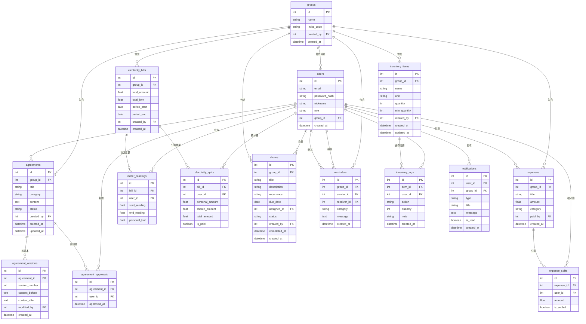

# 資料庫設計文件：宿舍共好 — 室友公約與噪音管理系統

---

## 1. ER 圖（實體關係圖）

以下使用 Mermaid erDiagram 語法描述所有資料表及其關聯：

---

## 2. 資料表詳細說明

### 2.1 users（使用者）

儲存系統所有使用者的帳號資料。

| 欄位 | 型別 | 必填 | 說明 |
| :--- | :--- | :---: | :--- |
| `id` | INTEGER | ✅ | 主鍵，自動遞增 |
| `email` | VARCHAR(120) | ✅ | 使用者信箱，用於登入（唯一值） |
| `password_hash` | VARCHAR(256) | ✅ | 密碼雜湊值（不儲存明文） |
| `nickname` | VARCHAR(50) | ✅ | 使用者暱稱，顯示在介面上 |
| `role` | VARCHAR(20) | ✅ | 角色：`admin`（管理者）或 `member`（一般成員），預設 `member` |
| `group_id` | INTEGER | ❌ | 所屬群組 ID（FK → groups.id），未加入群組時為 NULL |
| `created_at` | DATETIME | ✅ | 帳號建立時間 |

- **PK**：`id`
- **FK**：`group_id` → `groups.id`
- **唯一約束**：`email`

---

### 2.2 groups（群組）

儲存寢室或租屋群組的資料。

| 欄位 | 型別 | 必填 | 說明 |
| :--- | :--- | :---: | :--- |
| `id` | INTEGER | ✅ | 主鍵，自動遞增 |
| `name` | VARCHAR(100) | ✅ | 群組名稱（如「312 寢室」） |
| `invite_code` | VARCHAR(20) | ✅ | 邀請碼，其他人透過此碼加入（唯一值） |
| `created_by` | INTEGER | ✅ | 建立者的使用者 ID（FK → users.id） |
| `created_at` | DATETIME | ✅ | 群組建立時間 |

- **PK**：`id`
- **FK**：`created_by` → `users.id`
- **唯一約束**：`invite_code`

---

### 2.3 agreements（公約）

儲存室友公約的最新內容。

| 欄位 | 型別 | 必填 | 說明 |
| :--- | :--- | :---: | :--- |
| `id` | INTEGER | ✅ | 主鍵，自動遞增 |
| `group_id` | INTEGER | ✅ | 所屬群組 ID（FK → groups.id） |
| `title` | VARCHAR(200) | ✅ | 公約標題 |
| `category` | VARCHAR(50) | ✅ | 分類：`noise`（噪音）、`hygiene`（衛生）、`finance`（費用）、`other`（其他） |
| `content` | TEXT | ✅ | 公約條文內容 |
| `status` | VARCHAR(20) | ✅ | 狀態：`pending`（待確認）、`active`（生效中）、`archived`（已封存） |
| `created_by` | INTEGER | ✅ | 提案人 ID（FK → users.id） |
| `created_at` | DATETIME | ✅ | 建立時間 |
| `updated_at` | DATETIME | ✅ | 最後更新時間 |

- **PK**：`id`
- **FK**：`group_id` → `groups.id`、`created_by` → `users.id`

---

### 2.4 agreement_versions（公約版本歷史）

每次公約修改時，記錄修改前後的差異。

| 欄位 | 型別 | 必填 | 說明 |
| :--- | :--- | :---: | :--- |
| `id` | INTEGER | ✅ | 主鍵，自動遞增 |
| `agreement_id` | INTEGER | ✅ | 對應的公約 ID（FK → agreements.id） |
| `version_number` | INTEGER | ✅ | 版本號（從 1 開始遞增） |
| `content_before` | TEXT | ❌ | 修改前的內容（第一版時為 NULL） |
| `content_after` | TEXT | ✅ | 修改後的內容 |
| `modified_by` | INTEGER | ✅ | 修改人 ID（FK → users.id） |
| `created_at` | DATETIME | ✅ | 修改時間 |

- **PK**：`id`
- **FK**：`agreement_id` → `agreements.id`、`modified_by` → `users.id`

---

### 2.5 agreement_approvals（公約同意記錄）

記錄每位室友對公約的確認同意。

| 欄位 | 型別 | 必填 | 說明 |
| :--- | :--- | :---: | :--- |
| `id` | INTEGER | ✅ | 主鍵，自動遞增 |
| `agreement_id` | INTEGER | ✅ | 對應的公約 ID（FK → agreements.id） |
| `user_id` | INTEGER | ✅ | 同意者 ID（FK → users.id） |
| `approved_at` | DATETIME | ✅ | 同意時間 |

- **PK**：`id`
- **FK**：`agreement_id` → `agreements.id`、`user_id` → `users.id`
- **唯一約束**：`(agreement_id, user_id)` 每人每約只能同意一次

---

### 2.6 expenses（共同開支）

儲存每一筆共同消費的記錄。

| 欄位 | 型別 | 必填 | 說明 |
| :--- | :--- | :---: | :--- |
| `id` | INTEGER | ✅ | 主鍵，自動遞增 |
| `group_id` | INTEGER | ✅ | 所屬群組 ID（FK → groups.id） |
| `title` | VARCHAR(200) | ✅ | 消費項目名稱（如「衛生紙」） |
| `amount` | FLOAT | ✅ | 消費金額 |
| `category` | VARCHAR(50) | ❌ | 消費類別（日用品、食物、其他） |
| `paid_by` | INTEGER | ✅ | 付款人 ID（FK → users.id） |
| `created_at` | DATETIME | ✅ | 記帳時間 |

- **PK**：`id`
- **FK**：`group_id` → `groups.id`、`paid_by` → `users.id`

---

### 2.7 expense_splits（開支分攤）

記錄每筆開支中，每人應分攤的金額與結清狀態。

| 欄位 | 型別 | 必填 | 說明 |
| :--- | :--- | :---: | :--- |
| `id` | INTEGER | ✅ | 主鍵，自動遞增 |
| `expense_id` | INTEGER | ✅ | 對應的開支 ID（FK → expenses.id） |
| `user_id` | INTEGER | ✅ | 被分攤者 ID（FK → users.id） |
| `amount` | FLOAT | ✅ | 該使用者應付金額 |
| `is_settled` | BOOLEAN | ✅ | 是否已結清，預設 FALSE |

- **PK**：`id`
- **FK**：`expense_id` → `expenses.id`、`user_id` → `users.id`

---

### 2.8 electricity_bills（電費帳單）

儲存每期電費帳單的總金額與計費期間。

| 欄位 | 型別 | 必填 | 說明 |
| :--- | :--- | :---: | :--- |
| `id` | INTEGER | ✅ | 主鍵，自動遞增 |
| `group_id` | INTEGER | ✅ | 所屬群組 ID（FK → groups.id） |
| `total_amount` | FLOAT | ✅ | 本期電費總金額 |
| `total_kwh` | FLOAT | ❌ | 本期總用電度數（可選填） |
| `period_start` | DATE | ✅ | 計費起始日期 |
| `period_end` | DATE | ✅ | 計費結束日期 |
| `created_by` | INTEGER | ✅ | 登錄者 ID（FK → users.id） |
| `created_at` | DATETIME | ✅ | 登錄時間 |

- **PK**：`id`
- **FK**：`group_id` → `groups.id`、`created_by` → `users.id`

---

### 2.9 meter_readings（電表度數）

記錄每期帳單中，各室友的電表起始與結束度數。

| 欄位 | 型別 | 必填 | 說明 |
| :--- | :--- | :---: | :--- |
| `id` | INTEGER | ✅ | 主鍵，自動遞增 |
| `bill_id` | INTEGER | ✅ | 對應帳單 ID（FK → electricity_bills.id） |
| `user_id` | INTEGER | ✅ | 登錄者 ID（FK → users.id） |
| `start_reading` | FLOAT | ✅ | 電表起始度數 |
| `end_reading` | FLOAT | ✅ | 電表結束度數 |
| `personal_kwh` | FLOAT | ✅ | 個人用電度數（自動計算 = end - start） |

- **PK**：`id`
- **FK**：`bill_id` → `electricity_bills.id`、`user_id` → `users.id`
- **唯一約束**：`(bill_id, user_id)` 每人每期只能登錄一次

---

### 2.10 electricity_splits（電費分攤）

儲存每期電費帳單的分攤結果。

| 欄位 | 型別 | 必填 | 說明 |
| :--- | :--- | :---: | :--- |
| `id` | INTEGER | ✅ | 主鍵，自動遞增 |
| `bill_id` | INTEGER | ✅ | 對應帳單 ID（FK → electricity_bills.id） |
| `user_id` | INTEGER | ✅ | 使用者 ID（FK → users.id） |
| `personal_amount` | FLOAT | ✅ | 個人用電費用 |
| `shared_amount` | FLOAT | ✅ | 公共用電均攤費用 |
| `total_amount` | FLOAT | ✅ | 應繳總額（= personal + shared） |
| `is_paid` | BOOLEAN | ✅ | 是否已繳費，預設 FALSE |

- **PK**：`id`
- **FK**：`bill_id` → `electricity_bills.id`、`user_id` → `users.id`

---

### 2.11 chores（家事任務）

儲存隱形管家的排班任務。

| 欄位 | 型別 | 必填 | 說明 |
| :--- | :--- | :---: | :--- |
| `id` | INTEGER | ✅ | 主鍵，自動遞增 |
| `group_id` | INTEGER | ✅ | 所屬群組 ID（FK → groups.id） |
| `title` | VARCHAR(200) | ✅ | 任務名稱（如「倒垃圾」） |
| `description` | TEXT | ❌ | 任務詳細說明 |
| `recurrence` | VARCHAR(20) | ✅ | 週期：`once`（一次性）、`daily`、`weekly`、`monthly` |
| `due_date` | DATE | ✅ | 到期日 |
| `assigned_to` | INTEGER | ✅ | 負責人 ID（FK → users.id） |
| `status` | VARCHAR(20) | ✅ | 狀態：`pending`（待完成）、`completed`（已完成），預設 `pending` |
| `created_by` | INTEGER | ✅ | 建立者 ID（FK → users.id） |
| `completed_at` | DATETIME | ❌ | 完成時間（完成時才填入） |
| `created_at` | DATETIME | ✅ | 建立時間 |

- **PK**：`id`
- **FK**：`group_id` → `groups.id`、`assigned_to` → `users.id`、`created_by` → `users.id`

---

### 2.12 reminders（匿名提醒）

儲存友善黑臉的匿名提醒記錄。**注意：`sender_id` 僅供冷卻機制與統計使用，不對接收者顯示。**

| 欄位 | 型別 | 必填 | 說明 |
| :--- | :--- | :---: | :--- |
| `id` | INTEGER | ✅ | 主鍵，自動遞增 |
| `group_id` | INTEGER | ✅ | 所屬群組 ID（FK → groups.id） |
| `sender_id` | INTEGER | ✅ | 發送者 ID（FK → users.id）⚠️ 不對接收者公開 |
| `receiver_id` | INTEGER | ✅ | 接收者 ID（FK → users.id） |
| `category` | VARCHAR(30) | ✅ | 分類：`noise`（噪音）、`hygiene`（衛生）、`other`（其他） |
| `message` | TEXT | ✅ | 提醒訊息內容 |
| `created_at` | DATETIME | ✅ | 發送時間 |

- **PK**：`id`
- **FK**：`group_id` → `groups.id`、`sender_id` → `users.id`、`receiver_id` → `users.id`

---

### 2.13 inventory_items（物資品項）

儲存共同物資的品項與庫存狀態。

| 欄位 | 型別 | 必填 | 說明 |
| :--- | :--- | :---: | :--- |
| `id` | INTEGER | ✅ | 主鍵，自動遞增 |
| `group_id` | INTEGER | ✅ | 所屬群組 ID（FK → groups.id） |
| `name` | VARCHAR(100) | ✅ | 物資名稱（如「衛生紙」） |
| `unit` | VARCHAR(20) | ✅ | 單位（如「包」、「瓶」、「個」） |
| `quantity` | INTEGER | ✅ | 目前庫存數量，預設 0 |
| `min_quantity` | INTEGER | ✅ | 最低庫存量（低於此值發出提醒），預設 0 |
| `created_by` | INTEGER | ✅ | 建立者 ID（FK → users.id） |
| `created_at` | DATETIME | ✅ | 建立時間 |
| `updated_at` | DATETIME | ✅ | 最後更新時間 |

- **PK**：`id`
- **FK**：`group_id` → `groups.id`、`created_by` → `users.id`

---

### 2.14 inventory_logs（物資操作記錄）

記錄每次入庫或出庫的操作。

| 欄位 | 型別 | 必填 | 說明 |
| :--- | :--- | :---: | :--- |
| `id` | INTEGER | ✅ | 主鍵，自動遞增 |
| `item_id` | INTEGER | ✅ | 對應物資 ID（FK → inventory_items.id） |
| `user_id` | INTEGER | ✅ | 操作人 ID（FK → users.id） |
| `action` | VARCHAR(10) | ✅ | 操作類型：`stock_in`（入庫）、`stock_out`（出庫） |
| `quantity` | INTEGER | ✅ | 操作數量 |
| `note` | VARCHAR(200) | ❌ | 備註 |
| `created_at` | DATETIME | ✅ | 操作時間 |

- **PK**：`id`
- **FK**：`item_id` → `inventory_items.id`、`user_id` → `users.id`

---

### 2.15 notifications（站內通知）

儲存系統發送給使用者的通知訊息。

| 欄位 | 型別 | 必填 | 說明 |
| :--- | :--- | :---: | :--- |
| `id` | INTEGER | ✅ | 主鍵，自動遞增 |
| `user_id` | INTEGER | ✅ | 接收者 ID（FK → users.id） |
| `group_id` | INTEGER | ✅ | 所屬群組 ID（FK → groups.id） |
| `type` | VARCHAR(30) | ✅ | 通知類型：`reminder`、`chore`、`inventory`、`agreement`、`expense` 等 |
| `title` | VARCHAR(200) | ✅ | 通知標題 |
| `message` | TEXT | ❌ | 通知內容 |
| `is_read` | BOOLEAN | ✅ | 是否已讀，預設 FALSE |
| `created_at` | DATETIME | ✅ | 通知建立時間 |

- **PK**：`id`
- **FK**：`user_id` → `users.id`、`group_id` → `groups.id`

---

## 3. SQL 建表語法

完整的 SQL 建表語法已儲存於 `database/schema.sql`，可直接執行以建立所有資料表。

---

> 📝 **本文件版本**：v1.0
> 📅 **建立日期**：2026-05-14
> 📄 **對應文件**：docs/PRD.md、docs/FLOWCHART.md、docs/ARCHITECTURE.md
