# 流程圖文件：宿舍共好 — 室友公約與噪音管理系統

---

## 1. 使用者流程圖（User Flow）

以下流程圖描述使用者從進入網站到操作各功能的完整路徑。

### 1.1 總覽流程

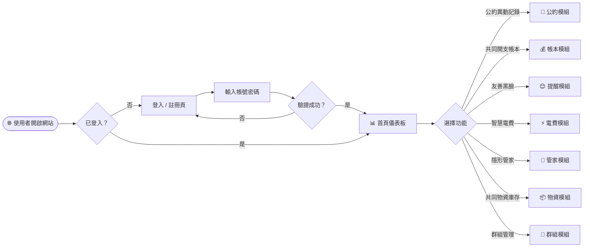

### 1.2 身份驗證流程

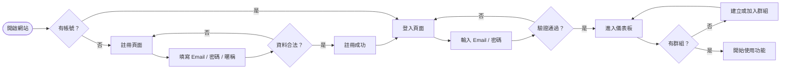

### 1.3 公約異動記錄流程

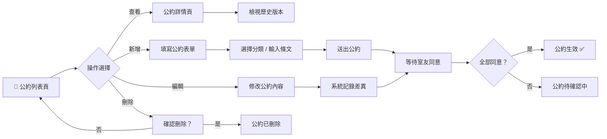

### 1.4 共同開支帳本流程

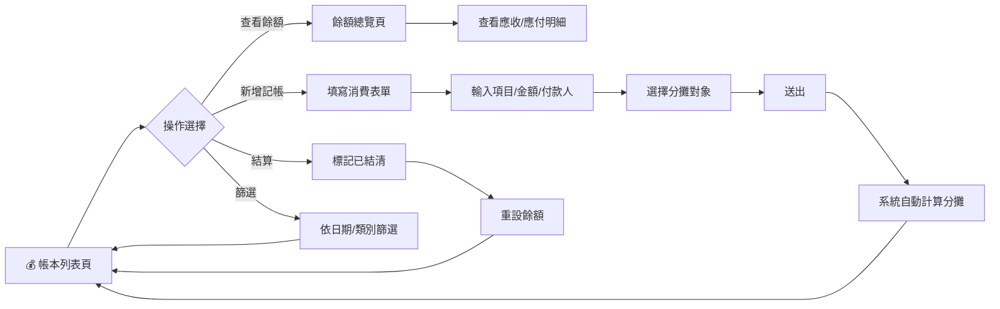

### 1.5 友善黑臉流程

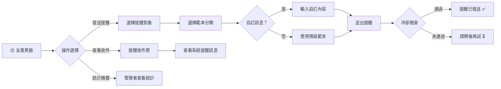

### 1.6 智慧電費流程

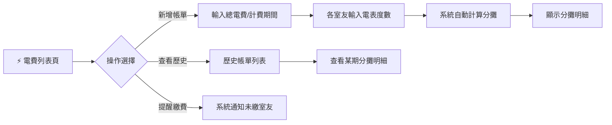

### 1.7 隱形管家流程

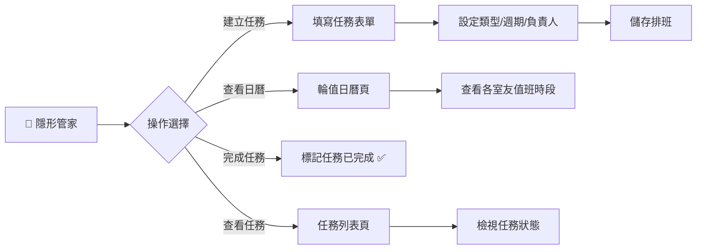

### 1.8 共同物資庫存流程

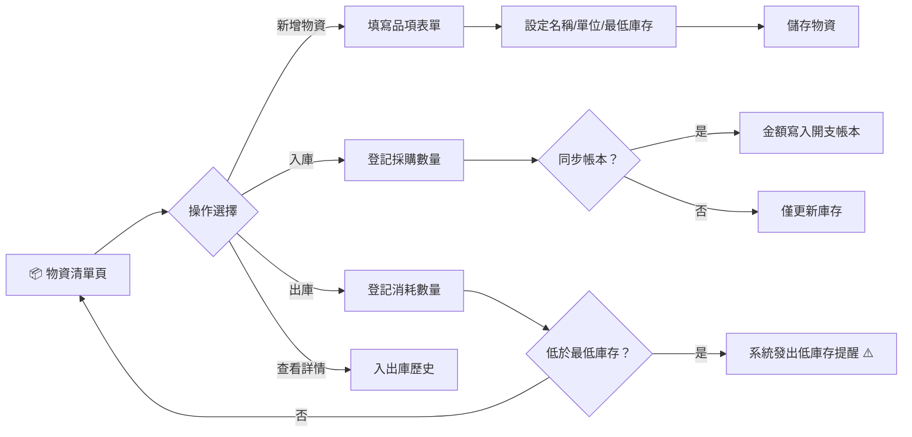

---

## 2. 系統序列圖（Sequence Diagram）

以下序列圖描述各核心功能中，資料從使用者操作到寫入資料庫的完整流動過程。

### 2.1 使用者註冊

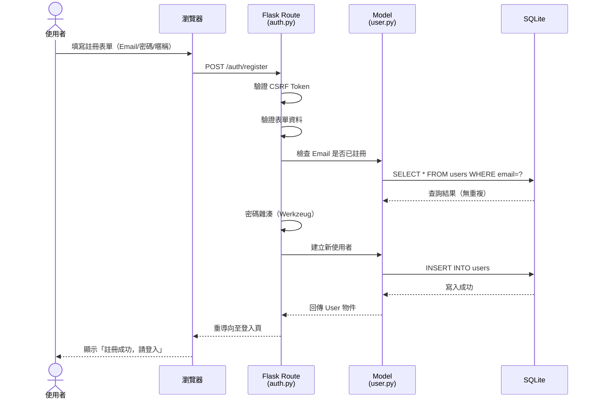

### 2.2 新增共同開支

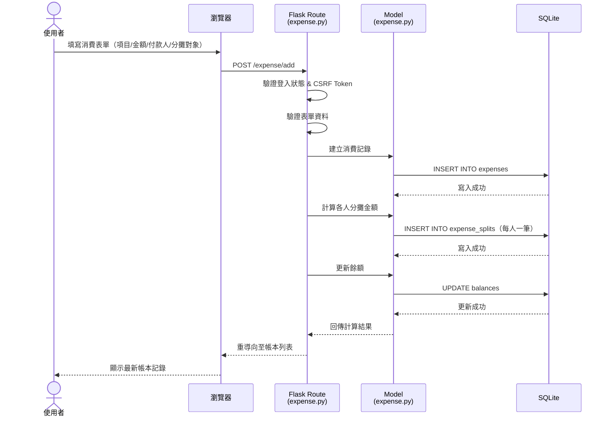

### 2.3 發送友善黑臉提醒

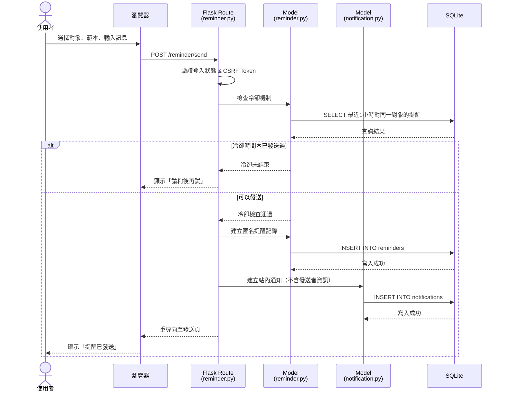

### 2.4 新增公約與同意機制

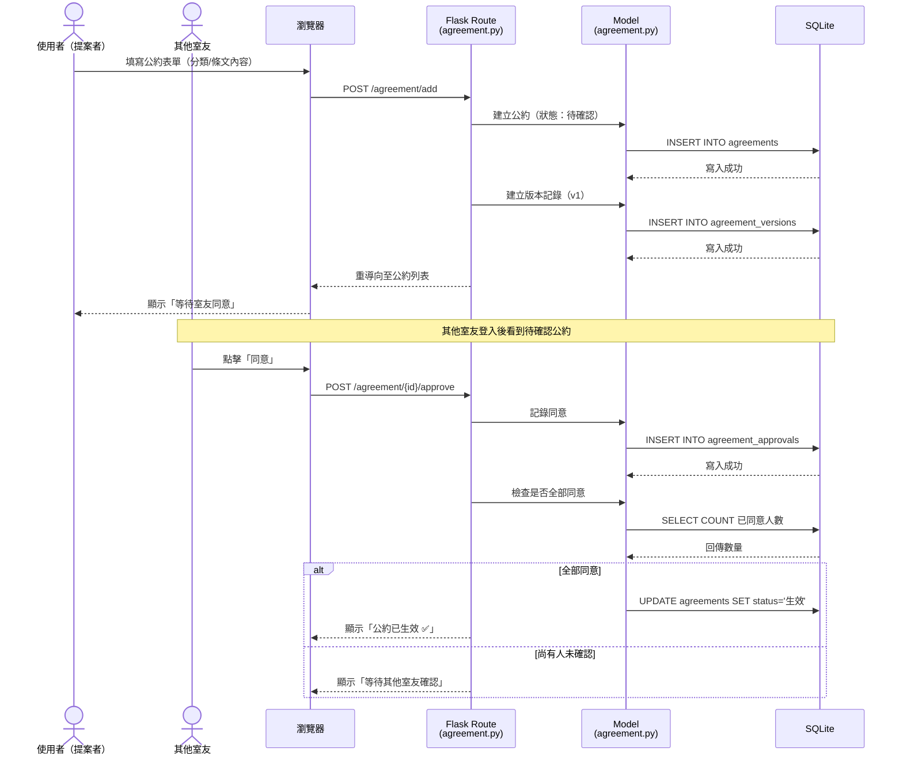

### 2.5 智慧電費分攤計算

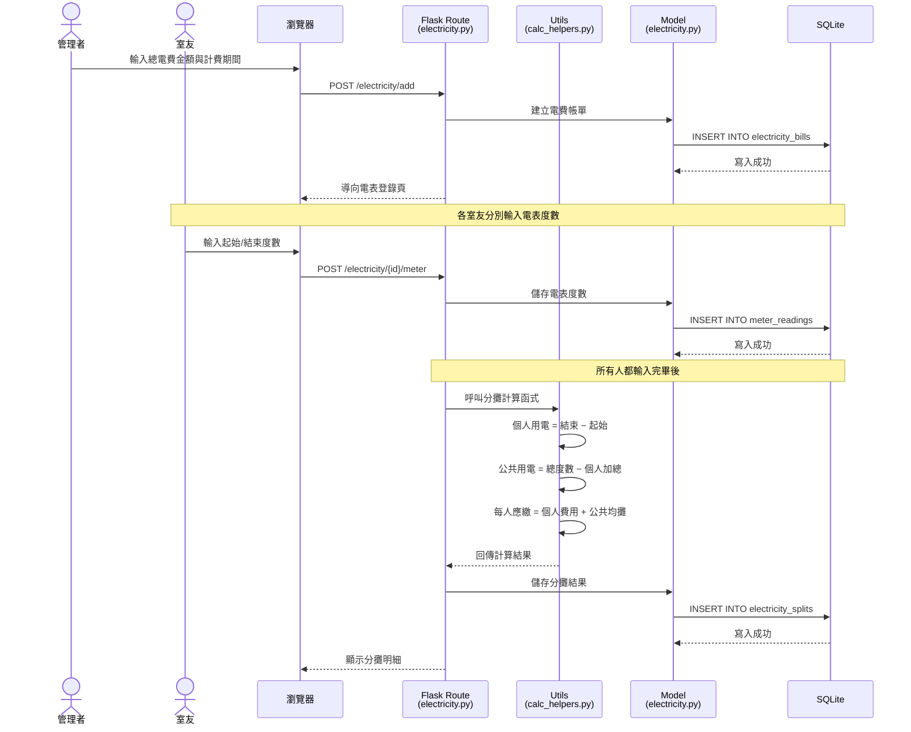

### 2.6 隱形管家任務完成

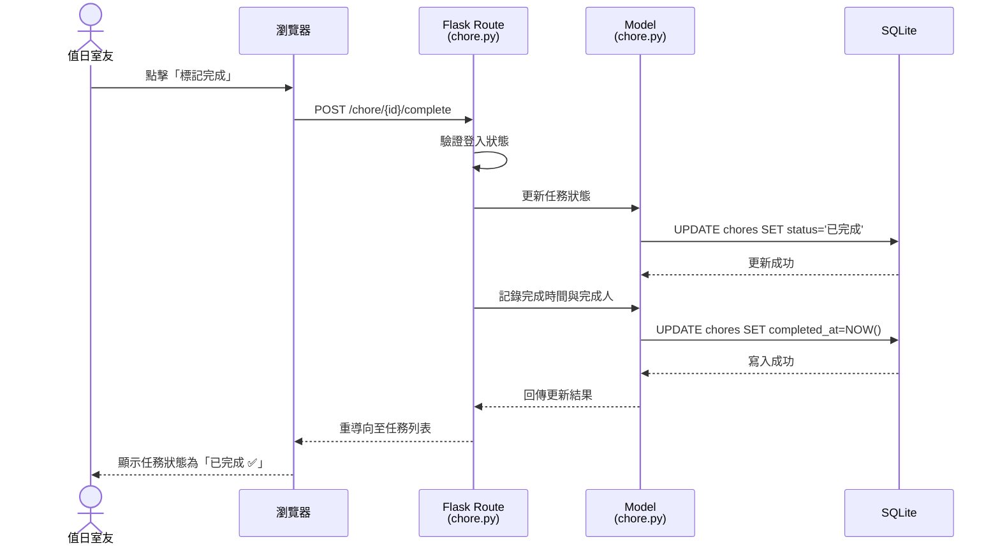

---

## 3. 功能清單對照表

下表列出系統所有主要功能對應的 URL 路徑與 HTTP 方法：

### 3.1 身份驗證（auth）

| 功能 | URL 路徑 | HTTP 方法 | 說明 |
| :--- | :--- | :---: | :--- |
| 註冊頁面 | `/auth/register` | GET | 顯示註冊表單 |
| 註冊處理 | `/auth/register` | POST | 處理註冊資料 |
| 登入頁面 | `/auth/login` | GET | 顯示登入表單 |
| 登入處理 | `/auth/login` | POST | 驗證帳號密碼 |
| 登出 | `/auth/logout` | GET | 清除登入狀態 |

### 3.2 儀表板（dashboard）

| 功能 | URL 路徑 | HTTP 方法 | 說明 |
| :--- | :--- | :---: | :--- |
| 首頁 | `/dashboard` | GET | 總覽通知、待辦、快捷入口 |

### 3.3 群組管理（group）

| 功能 | URL 路徑 | HTTP 方法 | 說明 |
| :--- | :--- | :---: | :--- |
| 建立群組頁面 | `/group/create` | GET | 顯示建立群組表單 |
| 建立群組處理 | `/group/create` | POST | 建立新群組 |
| 加入群組頁面 | `/group/join` | GET | 顯示加入群組表單 |
| 加入群組處理 | `/group/join` | POST | 以邀請碼加入群組 |
| 群組設定 | `/group/settings` | GET | 群組資訊與成員管理 |
| 更新群組設定 | `/group/settings` | POST | 儲存群組設定變更 |

### 3.4 公約異動記錄（agreement）

| 功能 | URL 路徑 | HTTP 方法 | 說明 |
| :--- | :--- | :---: | :--- |
| 公約列表 | `/agreement` | GET | 顯示所有公約 |
| 新增公約頁面 | `/agreement/add` | GET | 顯示新增表單 |
| 新增公約處理 | `/agreement/add` | POST | 儲存新公約 |
| 公約詳情 | `/agreement/<id>` | GET | 查看條文與歷史版本 |
| 編輯公約頁面 | `/agreement/<id>/edit` | GET | 顯示編輯表單 |
| 編輯公約處理 | `/agreement/<id>/edit` | POST | 儲存修改並記錄差異 |
| 刪除公約 | `/agreement/<id>/delete` | POST | 刪除指定公約 |
| 同意公約 | `/agreement/<id>/approve` | POST | 室友確認同意 |

### 3.5 共同開支帳本（expense）

| 功能 | URL 路徑 | HTTP 方法 | 說明 |
| :--- | :--- | :---: | :--- |
| 帳本列表 | `/expense` | GET | 顯示所有消費記錄 |
| 新增記帳頁面 | `/expense/add` | GET | 顯示記帳表單 |
| 新增記帳處理 | `/expense/add` | POST | 儲存消費並計算分攤 |
| 餘額總覽 | `/expense/balance` | GET | 各人應收/應付金額 |
| 結算 | `/expense/settle` | POST | 標記已結清、重設餘額 |

### 3.6 智慧電費（electricity）

| 功能 | URL 路徑 | HTTP 方法 | 說明 |
| :--- | :--- | :---: | :--- |
| 帳單列表 | `/electricity` | GET | 顯示歷史電費帳單 |
| 新增帳單頁面 | `/electricity/add` | GET | 顯示帳單登錄表單 |
| 新增帳單處理 | `/electricity/add` | POST | 儲存帳單資料 |
| 帳單詳情 | `/electricity/<id>` | GET | 查看分攤明細 |
| 登錄電表頁面 | `/electricity/<id>/meter` | GET | 顯示電表登錄表單 |
| 登錄電表處理 | `/electricity/<id>/meter` | POST | 儲存度數並觸發計算 |

### 3.7 隱形管家（chore）

| 功能 | URL 路徑 | HTTP 方法 | 說明 |
| :--- | :--- | :---: | :--- |
| 任務列表 | `/chore` | GET | 顯示所有任務 |
| 輪值日曆 | `/chore/calendar` | GET | 視覺化顯示排班 |
| 新增任務頁面 | `/chore/add` | GET | 顯示任務表單 |
| 新增任務處理 | `/chore/add` | POST | 儲存任務與排班 |
| 編輯任務頁面 | `/chore/<id>/edit` | GET | 顯示編輯表單 |
| 編輯任務處理 | `/chore/<id>/edit` | POST | 儲存修改 |
| 完成任務 | `/chore/<id>/complete` | POST | 標記任務已完成 |

### 3.8 友善黑臉（reminder）

| 功能 | URL 路徑 | HTTP 方法 | 說明 |
| :--- | :--- | :---: | :--- |
| 發送提醒頁面 | `/reminder/send` | GET | 顯示發送表單 |
| 發送提醒處理 | `/reminder/send` | POST | 建立匿名提醒 |
| 提醒收件匣 | `/reminder/inbox` | GET | 查看收到的提醒 |
| 統計摘要 | `/reminder/stats` | GET | 管理者查看統計資料 |

### 3.9 共同物資庫存（inventory）

| 功能 | URL 路徑 | HTTP 方法 | 說明 |
| :--- | :--- | :---: | :--- |
| 物資清單 | `/inventory` | GET | 顯示所有物資品項 |
| 新增物資頁面 | `/inventory/add` | GET | 顯示新增表單 |
| 新增物資處理 | `/inventory/add` | POST | 儲存新物資品項 |
| 物資詳情 | `/inventory/<id>` | GET | 查看入出庫歷史 |
| 編輯物資頁面 | `/inventory/<id>/edit` | GET | 顯示編輯表單 |
| 編輯物資處理 | `/inventory/<id>/edit` | POST | 儲存修改 |
| 入庫登記 | `/inventory/<id>/stock-in` | POST | 登記採購數量 |
| 出庫登記 | `/inventory/<id>/stock-out` | POST | 登記消耗數量 |

---

> 📝 **本文件版本**：v1.0
> 📅 **建立日期**：2026-05-14
> 📄 **對應文件**：docs/PRD.md、docs/ARCHITECTURE.md
